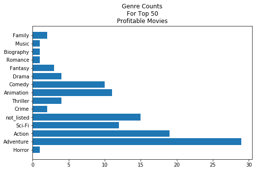

# Investigating Movie Data
*add in hyperlinks to these items* 
* blog link: 
* video recording:
* presentation.pdf: 

# Table Of Contents
* [Purpose](#purpose)
* [Data Description](#data-description)
* [Question 1](#question-1-write-question-herequestion1ipynb)
* [Wrap Up](#wrap-up)
* [Future Work](#future-work)
  


<!---
# = h1
## = h2
### = h3
#### = h4
##### = h5
--->

# Purpose
write some purpose for investigation here

# Data Description
list of files
* tmdb.movies.csv.gz
* tn.movies_budgets.csv.gz

<!--- Q1 without dropdown--->
## [Question 1: {Write question here}](./Question1.ipynb)

### Tables Used
* table goes here

### EDA


### Conclusion
write some conclusion/findings here

### Recommendation
write recommendation here


<!--- Q1 with dropdown--->
<details><summary style="font-size: 24px"> Question 1:{Write question here} </summary>

### Tables Used
* table goes here

### EDA


### Conclusion
write some conclusion/findings here

### Recommendation
write recommendation here

</details>


### How do I bold text?
this text is now **bold** 
`this text is now **bold** `

### How do I italicize text?
this text is now *italicized*
`this text is now *italicized* `

### How do I do both?
this text is now ***bold and italicized***
`this text is now ***bold and italicized***`

### How to make a codeblock
use '```' on both sides of codeblock

```
def transform_table(df):
    return df_transformed
```

you can also add language specific syntax highlighting

```python
def transform_table(df):
    return df_transformed
```

### How do I make a table? 

|column 1 | column 2| column 3|
|:-------:|:-------:|:-------:| 
|this is data for column 1 | this is data for columns 2 | |
| more data for c1 | more data for c2 | data for c3|


# Wrap up
include your recommendations and a summary of your findings

# Future Work
* bullet list of things you plan on doing in the future

